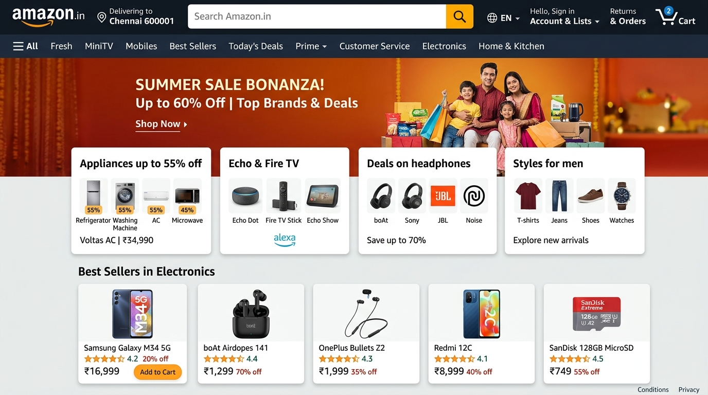

# Amazon E-Commerce Platform

A full-stack e-commerce web application replicating the Amazon India desktop user experience. Built with React 19, Vite, and Vanilla CSS on the frontend, and backed by a FastAPI asynchronous REST API with PostgreSQL and SQLAlchemy ORM.

---

## Architecture Overview

- **Frontend**: React 19 single-page application powered by Vite, styled with custom Vanilla CSS adhering to Amazon design specifications (layout, typography, color schemes, and component hierarchy).
- **Backend**: Asynchronous FastAPI service exposing RESTful endpoints for catalog data, category collections, and shopping cart persistence.
- **Database**: PostgreSQL with SQLAlchemy 2.0 AsyncIO and asyncpg driver.

---

## User Interface Preview



---

## Key Features

### Header & Navigation
- Complete Amazon navigation bar with logo branding, location indicator, and category-filtered search bar.
- Dynamic search department selector populated from catalog data.
- Live shopping cart count with synchronized state.
- Secondary department navigation menu with direct filtering.

### Hero Promotional Carousel
- Full-width promotional banner carousel with automated cycling and pause-on-hover functionality.
- Interactive slide navigation controls and indicators.
- Seamless bottom gradient transition into the main content background.

### 2x2 Category Cards Grid
- Multi-column desktop grid with 2x2 thumbnail cards overlapping the hero banner.
- Image zoom transitions and direct category deep links.
- Smart fallbacks and referrer handling for external CDN assets.

### Product Showcase & Deals Rail
- Product cards displaying badges (Best Seller, Amazon's Choice, Limited Deals), star ratings, review counts, localized Indian Rupee (INR) pricing, and Prime delivery tags.
- Direct Add-to-Cart functionality with real-time feedback.

---

## Tech Stack

| Component | Technology | Version / Details |
|---|---|---|
| Frontend Framework | React | 19.x |
| Frontend Tooling | Vite | 8.x |
| Styling | Vanilla CSS | Custom design system |
| Backend Framework | FastAPI | Asynchronous REST API |
| ASGI Server | Uvicorn | 0.52.x |
| Database | PostgreSQL | Relational database |
| ORM | SQLAlchemy | 2.0 (AsyncIO) |
| DB Driver | asyncpg | High-performance async driver |
| Language | Python | 3.12+ |

---

## Project Structure

```text
amazon/
├── database.py              # Async PostgreSQL engine and session configuration
├── models.py                # SQLAlchemy ORM models (Product, CategoryCard)
├── main.py                  # FastAPI application and route handlers
├── seed.py                  # Database seed script
├── docs/
│   └── screenshot.png       # Application UI screenshot
├── frontend/
│   ├── index.html           # HTML entry point with metadata
│   ├── vite.config.js       # Vite configuration
│   ├── package.json         # Frontend dependencies and build scripts
│   └── src/
│       ├── main.jsx         # React application root mount
│       ├── App.jsx          # Primary application page with state management
│       ├── api.js           # API client service layer
│       ├── index.css        # Global stylesheet and responsive grid layout
│       └── components/
│           ├── Header.jsx         # Top navigation and search bar
│           ├── Header.css
│           ├── HeroBanner.jsx     # Full-width promotional banner carousel
│           ├── HeroBanner.css
│           ├── CategoryCard.jsx   # 2x2 grid white category cards
│           ├── CategoryCard.css
│           ├── ProductCard.jsx    # Individual product cards with price/rating
│           ├── ProductCard.css
│           ├── ProductSection.jsx # Horizontal product display rails
│           ├── ProductSection.css
│           ├── Footer.jsx         # Multi-column footer navigation
│           └── Footer.css
└── README.md                # Project documentation
```

---

## API Documentation

| Method | Endpoint | Description | Query Parameters | Request Body |
|---|---|---|---|---|
| `GET` | `/api/products` | Retrieve all products | `category`, `search`, `badge` | None |
| `GET` | `/api/products/{id}` | Retrieve product by ID | None | None |
| `GET` | `/api/categories` | Retrieve 2x2 category cards | None | None |
| `GET` | `/api/cart` | Get current cart items and count | None | None |
| `POST` | `/api/cart` | Add product to shopping cart | None | `{"product_id": int}` |
| `DELETE` | `/api/cart/{id}` | Remove product from cart | None | None |

---

## Setup and Installation

### Prerequisites
- Python 3.12 or higher
- Node.js 18 or higher with npm
- PostgreSQL database server running on `localhost:5432`

### 1. Backend Setup
1. Create and activate a Python virtual environment:
   ```bash
   python3 -m venv venv
   source venv/bin/activate
   ```

2. Install backend dependencies:
   ```bash
   pip install fastapi uvicorn sqlalchemy asyncpg pydantic
   ```

3. Ensure PostgreSQL database `amazon` is created, then run the seed script:
   ```bash
   python seed.py
   ```

4. Start the FastAPI development server:
   ```bash
   uvicorn main:app --reload --host 0.0.0.0 --port 8000
   ```
   Interactive OpenAPI documentation is accessible at `http://localhost:8000/docs`.

### 2. Frontend Setup
1. Navigate to the frontend directory:
   ```bash
   cd frontend
   ```

2. Install Node dependencies:
   ```bash
   npm install
   ```

3. Start the Vite development server:
   ```bash
   npm run dev
   ```

4. Open `http://localhost:5173` in your web browser.

---

## Production Build

To compile and bundle the frontend for production:

```bash
cd frontend
npm run build
```

The production assets will be generated in `frontend/dist/`.

---

## License

This project is open-source and intended for demonstration and educational purposes.
